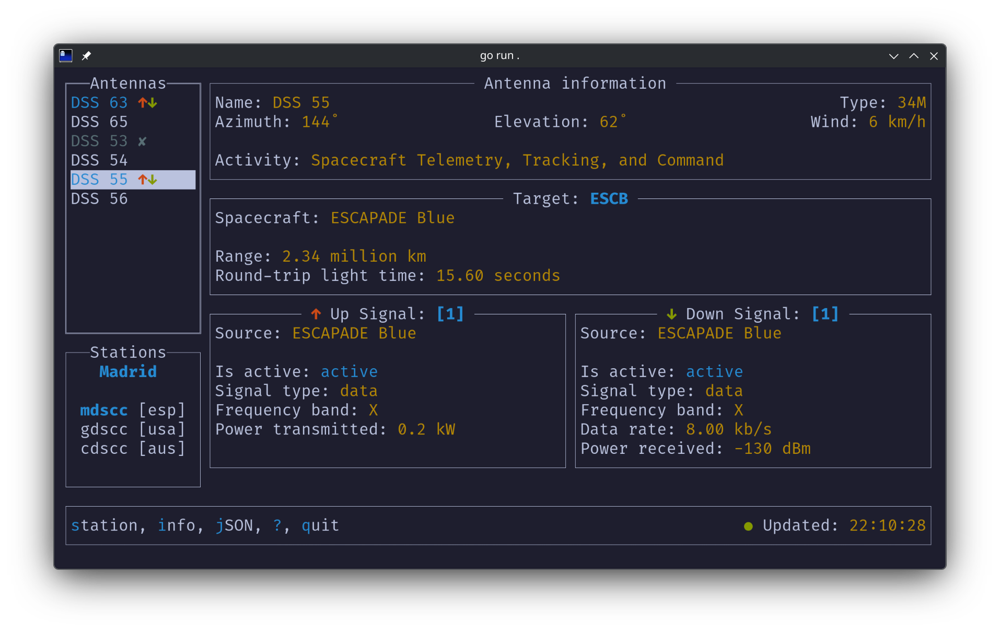

# Go NASA Deep Space Network Now

Unofficial terminal UI for live monitoring the [NASA Deep Space Network](https://www.nasa.gov/directorates/somd/space-communications-navigation-program/what-is-the-deep-space-network/).

The DSN is a global system of large antennas and communication facilities used to track, send commands, and receive data from spacecraft exploring deep space. Operated by NASA's Jet Propulsion Laboratory (JPL), it supports missions to the Moon, Mars, outer planets, and beyond, including Voyager, Perseverance, and the James Webb Space Telescope.

---

## Features

- **Live monitoring.** Data updates are nearly instantaneous.
- **Station and antenna overview.** See current targets, distances, and round-trip light time values.
- **Signal details.** Observe signal strength, frequency, data rate, and modulation type for up and down links.
- **Signal sparklines.** Scrolling mini-charts show recent signal activity per dish.
- **Interactive navigation.** Select stations, antennas, targets, and signals.
- **Themes.** Cycle through 3 built-in color themes: cosmic, solar, and nord.
- **Bookmarks.** Star dishes of interest. Bookmarks persist across sessions.
- **Compact view.** Toggle between a detailed view and a compact table with sortable columns.
- **Distance units.** Cycle between km, AU, light-minutes, and light-hours.
- **Signal notifications.** Status bar alerts when signals are acquired or lost.
- **Connection indicator.** Colored dot shows whether the feed is connected, degraded, or disconnected.

## Keyboard Shortcuts

| Key       | Action                          |
| --------- | ------------------------------- |
| `s`       | Cycle through stations          |
| `t`       | Cycle through targets           |
| `u`       | Cycle through up signals        |
| `d`       | Cycle through down signals      |
| `↑` `↓`   | Navigate dishes list            |
| `b`       | Toggle bookmark on current dish |
| `c`       | Toggle compact view             |
| `S`       | Cycle compact sort mode         |
| `T`       | Cycle through themes            |
| `U`       | Cycle distance unit             |
| `y`       | Copy visible content to clipboard |
| `+` `-`   | Adjust refresh interval         |
| `?`       | Show help                       |
| `Esc`     | Close modal                     |
| `q`       | Quit                            |

## Installation

0. Requires [Go](https://go.dev/) to be installed
1. Install: `go install github.com/RustyDaemon/go-dsn-now@latest`
2. Run: `go-dsn-now`

> **Note:** If you get `command not found`, make sure `$GOPATH/bin` is in your `PATH`. Run `go env GOPATH` to find it.

## License

Licensed under [Apache 2.0](LICENSE). Third-party dependencies are subject to their own licenses.

[NASA Deep Space Network Now](https://eyes.nasa.gov/dsn/dsn.html) data is sourced from NASA and used for educational and informational purposes only. This project is not affiliated with NASA or any of its subsidiaries.
