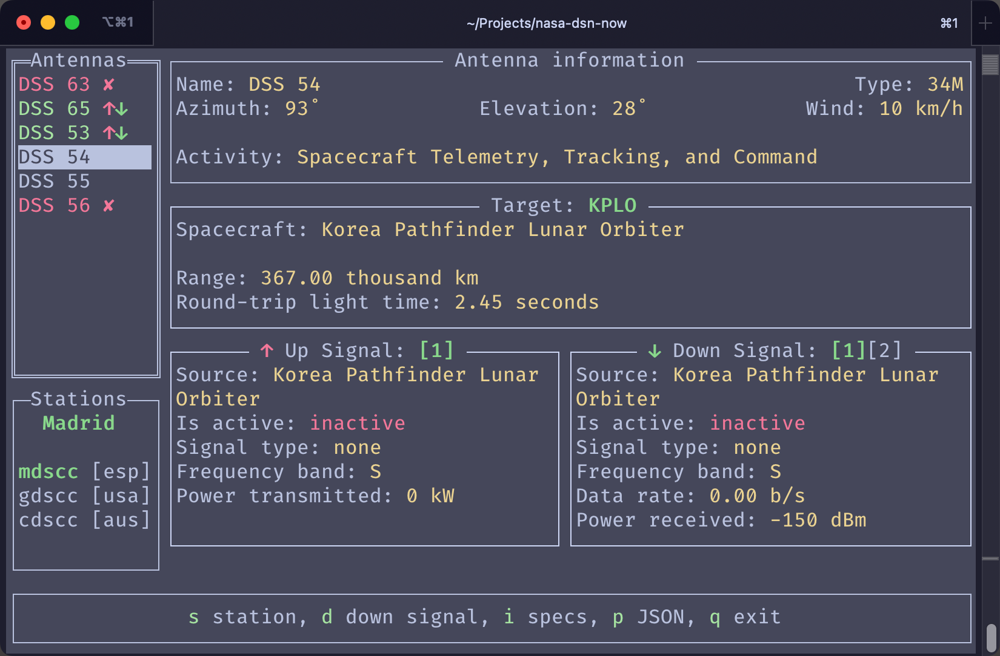

# Go NASA Deep Space Network Now

This is unofficial application for live monitoring the [NASA Deep Space Network Now](https://www.nasa.gov/directorates/somd/space-communications-navigation-program/what-is-the-deep-space-network/).

The NASA Deep Space Network (DSN) is a global system of large antennas and communication facilities used to track, send commands, and receive data from spacecraft exploring deep space. Operated by NASA’s Jet Propulsion Laboratory (JPL), the DSN supports missions to the Moon, Mars, outer planets, and beyond, including the Voyager, Perseverance, and James Webb Space Telescope.

---



<details>
<summary>More screenshots</summary>
<p align="center">
  
  
  
</p>
</details>

## Features

- **Live monitoring with real-time, detailed data.** Data updates are almost instantaneous.
- **Display targets being tracked by the stations.** You can visualize the current target, distance, and round-trip light time value.
- **Display up and down signals for each station.** You can observe the signal strength, frequency, data rate, and modulation type.
- **Interactive.** You can select a station, antenna, current target, and both types of signals.
- **Informative.** You can access detailed information about the station, antenna, target, and signals.


## Installation

- Prerequisites: `Go`
- Run the following command to install the application:
```bash
go install github.com/RustyDaemon/go-dsn-now@latest
```
- Run the application:
```bash
go-dsn-now
```


## Keymaps

| Keymap   | Description                        |
|----------|------------------------------------|
| `↑`, `↓` | Select antenna                     |
| `s`      | Select station                     |
| `t`      | Switch target *                    |
| `d`      | Switch Down signal *               |
| `u`      | Switch Up signal *                 |
| `i`      | See detailed antenna specification |
| `p`      | See JSON structured data           |
| `ESC`    | Close a popup *                    |
| `q`      | Quit the application               |

`*` - available only if the respective data is available.

## License

This project is licensed under the Apache 2.0 License - see the [LICENSE](LICENSE) file for details.

The project uses other libraries and frameworks that are licensed under different licenses. Please refer to the respective libraries for their licenses.

NASA Deep Space Network Now data is provided by NASA and is subject to their terms and conditions.

## Thanks

Thanks to NASA for providing the data for this application - [NASA Deep Space Network Now API](https://eyes.nasa.gov/dsn/dsn.html).